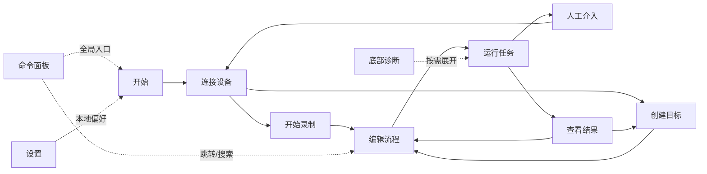
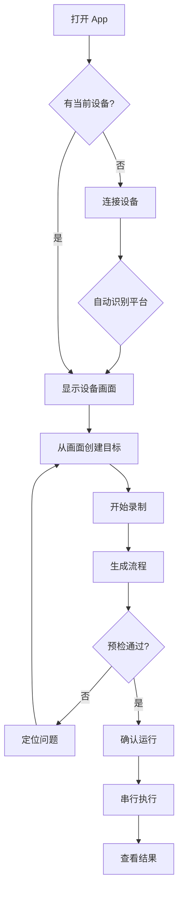
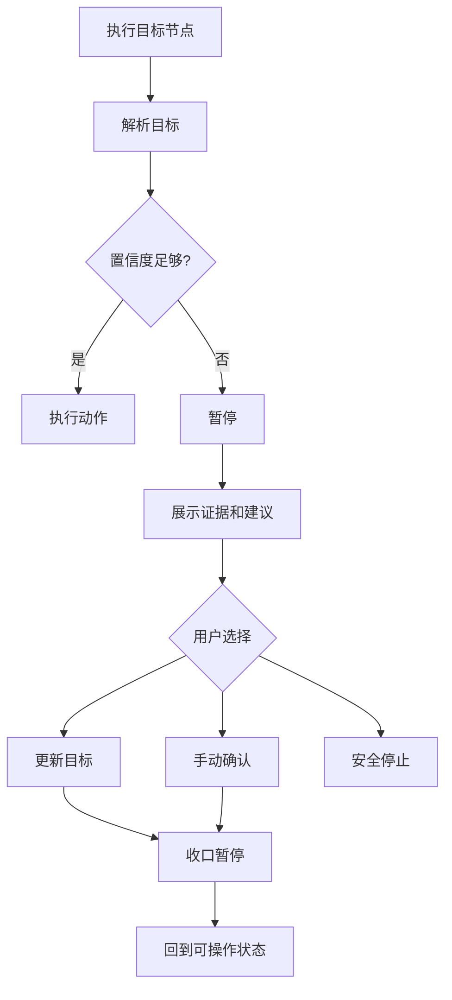
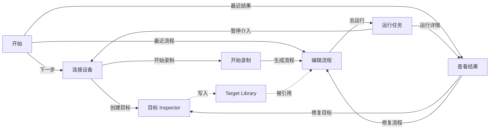

# V3.0 Enterprise Design Master Brief

## 0. Decision

V3.0 的设计方向从 `Tech Noir Enterprise Workstation` 调整为 `Native Quiet Mobile Workstation`。

原因：用户体验优先于产品一致性、可维护性、开发效率和历史兼容性。V2/V3 既有文档中的深色 Tech Noir 可以作为历史实现风格和高对比模式参考，但不应继续作为 V3.0 默认产品体验。V3.0 默认应更像成熟 macOS 原生工作站：安静、克制、清楚、可长期使用，而不是控制台、Dashboard 或 Hacker 工具。

设计优先级：

```text
UX > Consistency > Maintainability > Development Efficiency > Backward Compatibility
```

## 1. Information Architecture

### 1.1 North Star

V3.0 的 IA 不按技术模块命名，而按用户任务命名。内部仍可保留 Dashboard、Device、Recorder、Workflow、Execute、Monitor 路由和文件名，以降低迁移风险；用户可见导航应转成任务语言。

### 1.2 User-Facing Navigation

| 用户任务 | 用户可见导航 | 现有模块映射 | 页面一句话目标 |
|---|---|---|---|
| 判断现在能不能开始 | 开始 | Dashboard | 告诉用户当前状态和下一步 |
| 连接并查看手机 | 连接设备 | Device | 让用户看到当前设备画面并可安全操作 |
| 捕获人工流程 | 开始录制 | Recorder | 把人工操作变成动作和目标 |
| 整理自动化流程 | 编辑流程 | Workflow | 让流程可读、可维护、可执行 |
| 运行并介入 | 运行任务 | Execute | 放心开始，看懂进度，安全停止 |
| 查看结果和证据 | 查看结果 | Monitor | 解释运行结果、失败原因和下一步 |

辅助入口：

- `Target Library`：不升为 L1。它是连接设备、录制、编辑流程共享的上下文面板。
- `Settings`：右侧 Drawer，不进入主任务流。
- `Bottom Console`：默认收起，只服务诊断，不抢主任务。
- `Command Palette`：全局效率入口，承载跳转、查找、安全命令和复制脱敏摘要。

### 1.3 IA Diagram



## 2. User Journey

### 2.1 First-Time User

1. 打开 App，看到“未连接设备”和一个主操作“连接设备”。
2. 点击一次连接设备，产品自动检查本机依赖、识别唯一当前设备并选择 iOS 或 Android 路径。
3. 成功后直接看到设备画面，不需要理解 Appium、WDA、ADB 或 session。
4. 用户从画面创建一个目标，系统自动建议目标类型和策略。
5. 用户录制几步人工操作，系统生成可读流程。
6. 用户点击运行，确认后串行执行。
7. 如果目标低置信，系统暂停并展示“哪里不确定、现在该怎么做”。
8. 用户在结果页看到任务状态、用例结果和问题类型，而不是一串日志。

### 2.2 Daily Operator

1. 打开 App 直接看到上次项目、当前设备、流程健康和建议动作。
2. 使用 `⌘K` 输入“运行”或“连接”快速到达任务。
3. 录制或修改目标时，主界面只展示业务名称、目标名称和状态；坐标、selector、OCR 细节默认隐藏。
4. 运行失败后，从结果页跳回目标或流程问题位置。

### 2.3 Automation Engineer

1. 使用同一界面复现用户问题。
2. 在 Inspector / Source / Bottom Console 中查看脱敏技术细节。
3. 通过 capability、Target Resolver 证据和 Run Detail 判断是设备、驱动、目标、流程还是断言问题。
4. 用 fake-testable 的状态模型维护 Runtime 和 adapter。

## 3. User Flow

### 3.1 Start To First Run



### 3.2 Low Confidence Pause



## 4. Page Responsibilities

### 4.1 开始

职责：判断当前工作站是否可开始，并给出一个最合理下一步。

默认展示：

- 当前状态摘要：未连接、可录制、可运行、需要介入、最近失败。
- 下一步主操作：连接设备、继续录制、修复目标、运行任务、查看失败。
- 最近流程和最近结果的轻量入口。

不展示：

- KPI 大屏、复杂图表、日志、驱动配置、完整设备标识。

### 4.2 连接设备

职责：连接当前唯一设备，展示设备画面，并支持安全远控和从画面创建目标。

默认展示：

- 当前设备摘要、平台、当前 App、连接状态。
- 大型设备预览。
- 一组主动作：连接设备、刷新画面、创建目标。

不展示：

- 多设备调度列表、完整 UDID/ADB serial、endpoint、原始 page source。

### 4.3 开始录制

职责：把人工操作转成 Target + Action 时间轴。

默认展示：

- 录制状态、设备预览、动作时间轴、生成流程主操作。
- 时间轴只显示用户可理解动作：点击“登录按钮”、等待“首页出现”、输入“手机号字段”。

不展示：

- 坐标、selector、OCR 原文、内部 action id。

### 4.4 编辑流程

职责：维护 Project DSL 真源，但用可视化任务语言呈现。

默认展示：

- 左侧：节点工具 / 目标库切换。
- 中间：画布 / 源码 / 检查。
- 右侧：节点 Inspector / 目标 Inspector。
- 顶部：流程健康和“去运行”。

不展示：

- 通用脚本 IDE、任意 JS/Python/shell、复杂资产管理后台。

### 4.5 运行任务

职责：放心开始、看懂进度、低置信时安全介入。

默认展示：

- 预检摘要、运行方式、主开始按钮。
- 运行中展示当前目标、当前动作、进度和安全停止。
- 暂停时展示原因、证据、建议动作。

不展示：

- 长日志、原始 capability JSON、无限循环模式。

### 4.6 查看结果

职责：解释运行结果、失败归因和证据。

默认展示：

- 任务状态、用例结果、问题类型分离。
- 运行历史、目标解析链、截图/日志/性能摘要。
- 复制脱敏诊断摘要。

不展示：

- 云端报告中心、团队测试管理、原始 logcat/syslog 长文本。

## 5. Page Relationship



## 6. Wireframe

### 6.1 Global Shell

```text
┌──────────────────────────────────────────────────────────────────────────────┐
│  当前项目  平台  设备  目标  流程  运行                 搜索/命令  设置      │
├──────┬───────────────────────────────────────────────────────────────────────┤
│ 开始 │                                                               主区域  │
│ 连接 │                                                                       │
│ 录制 │                                                                       │
│ 流程 │                                                                       │
│ 运行 │                                                                       │
│ 结果 │                                                                       │
│      │                                                                       │
├──────┴───────────────────────────────────────────────────────────────────────┤
│  诊断  ·  最近事件摘要                                      展开 Console  │
└──────────────────────────────────────────────────────────────────────────────┘
```

### 6.2 开始

```text
┌──────────────────────────────────────────────────────────────────────────────┐
│ 今天                                                                       │
│ ┌────────────────────────────────────────────────────────────────────────┐ │
│ │ 当前不能运行：还没有连接设备                         [连接设备]        │ │
│ │ 连接后可创建目标、录制流程并运行。                                     │ │
│ └────────────────────────────────────────────────────────────────────────┘ │
│ ┌───────────────────────┐ ┌───────────────────────┐ ┌──────────────────┐ │
│ │ 当前设备              │ │ 当前流程              │ │ 最近结果         │ │
│ │ 未连接                │ │ 6 个节点，1 个提醒    │ │ 2 次暂停         │ │
│ └───────────────────────┘ └───────────────────────┘ └──────────────────┘ │
│ 最近流程                                      最近问题                     │
│ ┌──────────────────────────────────────┐   ┌────────────────────────────┐ │
│ │ 登录检查 · 可运行       [编辑] [运行] │   │ 目标低置信 · 去修复        │ │
│ │ 下单流程 · 需修复目标   [查看]        │   │ 设备断开 · 查看详情        │ │
│ └──────────────────────────────────────┘   └────────────────────────────┘ │
└──────────────────────────────────────────────────────────────────────────────┘
```

### 6.3 连接设备

```text
┌──────────────────────────────────────────────────────────────────────────────┐
│ 连接设备                                      [刷新画面] [创建目标] [断开]  │
│ ┌───────────────────────────────┐ ┌──────────────────────────────────────┐ │
│ │ 当前设备                      │ │                                      │ │
│ │ iPhone / Android · 已连接     │ │             设备画面预览             │ │
│ │ 当前 App：示例 App            │ │                                      │ │
│ │ 资源：空闲                    │ │       点击、滑动、选择区域反馈       │ │
│ │                               │ │                                      │ │
│ │ 下一步：开始录制              │ │                                      │ │
│ └───────────────────────────────┘ └──────────────────────────────────────┘ │
│ 本机准备：全部就绪 · 目标：3 个可用 · 最近截图：刚刚                       │
└──────────────────────────────────────────────────────────────────────────────┘
```

### 6.4 开始录制

```text
┌──────────────────────────────────────────────────────────────────────────────┐
│ 开始录制                          [开始录制] [停止] [生成流程]             │
│ ┌──────────────────────────────────────┐ ┌───────────────────────────────┐ │
│ │              设备画面                │ │ 动作时间轴                    │ │
│ │        点击画面或选择目标            │ │ 1 点击 登录按钮               │ │
│ │                                      │ │ 2 等待 首页出现               │ │
│ │                                      │ │ 3 输入 手机号字段             │ │
│ └──────────────────────────────────────┘ │ 4 点击 下一步                 │ │
│ 录制状态：空闲 · 可截图 · 运行未占用     └───────────────────────────────┘ │
└──────────────────────────────────────────────────────────────────────────────┘
```

### 6.5 编辑流程

```text
┌──────────────────────────────────────────────────────────────────────────────┐
│ 编辑流程                           画布  源码  检查        [去运行]        │
├──────────────────┬──────────────────────────────────┬──────────────────────┤
│ 节点 / 目标       │                                  │ Inspector            │
│ 搜索目标          │       Start ─ 点击目标 ─ 等待     │ 目标：登录按钮       │
│ 登录按钮          │                    │             │ 找不到时：暂停       │
│ 首页标题          │              断言文字 ─ End       │ 低置信时：暂停       │
│ 商品卡片          │                                  │ 最近验证：可用       │
│ + 新建目标        │                                  │ [测试识别] [保存]    │
└──────────────────┴──────────────────────────────────┴──────────────────────┘
```

### 6.6 运行任务

```text
┌──────────────────────────────────────────────────────────────────────────────┐
│ 运行任务                                                       [安全停止]  │
│ ┌───────────────────────────────┐ ┌──────────────────────────────────────┐ │
│ │ 预检                          │ │ 当前运行                             │ │
│ │ 设备：就绪                    │ │ 登录检查 · 第 1/1 轮                 │ │
│ │ 目标：1 个提醒                │ │ 当前：等待 首页标题                  │ │
│ │ 流程：可运行                  │ │ 置信度：92%                          │ │
│ │ 资源：空闲                    │ │ 进度：████████░░                     │ │
│ │ [开始运行]                    │ │ 最近证据：截图、目标解析、日志摘要   │ │
│ └───────────────────────────────┘ └──────────────────────────────────────┘ │
│ 暂停介入区：仅在 paused 时出现，展示原因、证据和收口动作                    │
└──────────────────────────────────────────────────────────────────────────────┘
```

### 6.7 查看结果

```text
┌──────────────────────────────────────────────────────────────────────────────┐
│ 查看结果                 7日 30日 90日                         [复制摘要] │
│ ┌────────────┐ ┌────────────┐ ┌────────────┐ ┌──────────────────────────┐ │
│ │ 任务完成率 │ │ 用例通过率 │ │ 暂停率     │ │ 目标解析失败率           │ │
│ └────────────┘ └────────────┘ └────────────┘ └──────────────────────────┘ │
│ 运行历史                                                                     │
│ ┌────────────────────────────────────────────────────────────────────────┐ │
│ │ 登录检查  已完成 / 通过      iOS      42s      查看详情                │ │
│ │ 下单流程  暂停 / 不确定      Android  1m12s    目标问题                │ │
│ └────────────────────────────────────────────────────────────────────────┘ │
│ 右侧详情 Drawer：路径、目标解析链、截图证据、日志、性能、建议               │
└──────────────────────────────────────────────────────────────────────────────┘
```

## 7. Enterprise Interaction Design

### 7.1 Navigation

- 侧边栏使用任务动词，内部模块名只作为工程命名。
- `⌘K` 是全局入口：搜索页面、目标、流程、最近结果和安全命令。
- 页面跳转不应清空当前工作上下文；回到上页时保留选中目标、画布视口和筛选条件。

### 7.2 Primary Action

- 每页只能有一个明确主操作。
- 主操作必须用用户结果命名：`连接设备`、`开始录制`、`生成流程`、`开始运行`、`复制摘要`。
- 机器可推断的内容不放到主操作前的表单中。

### 7.3 Progressive Disclosure

- 默认层：状态、结果、下一步。
- Inspector 层：字段、策略、引用、诊断。
- Source / Advanced 层：DSL、底层字段、脱敏 payload 摘要。
- Bottom Console 层：日志、驱动、目标解析、性能采样。

### 7.4 Drawers And Popovers

- 右侧 Drawer 用于详情和编辑，不用多层 Modal。
- Popover 用于轻量选择：目标类型、失败策略、等待策略。
- Modal 只用于不可逆或高风险动作：开始运行确认、删除被引用资源、安全停止确认候选。

### 7.5 Device Resource Lock

- 资源锁用普通语言表达：`空闲`、`正在远控`、`正在录制`、`正在运行`、`等待人工确认`、`正在停止`。
- 锁定时解释“现在不能做什么”和“可以做什么”，不要只禁用按钮。
- paused 是人工介入态，不是失败态；界面应提供更新目标、手动确认、安全停止三类动作。

### 7.6 Target Creation

- 从画面创建目标默认先让用户框选或点击，再由系统建议类型。
- Target Inspector 首屏展示名称、用途、平台、最近验证结果。
- selector、OCR 原文、阈值和 fallback 进入高级区。
- 测试识别必须产生可读证据，不直接执行点击。

### 7.7 Results

- Run Status、Test Result、Issue Category 必须分开展示。
- 文案示例：
  - `任务已完成，用例通过`
  - `任务暂停，等待人工确认`
  - `任务失败，驱动未就绪`
  - `任务已完成，断言失败`
- 不把所有非通过都叫失败。

### 7.8 macOS Behaviors

- 支持 `⌘K`、`⌘,`、`⌘R`、`⌘F`、`Space` 预览、`Esc` 关闭浮层。
- 支持拖目标到画布、拖截图区域生成目标、右键打开上下文菜单。
- 使用系统字体、系统滚动、系统焦点态和轻量动画。
- 动效 150-220ms，只解释状态变化；支持减少动态效果。

## 8. HTML Static Prototype Plan

本阶段不直接写 HTML。HTML 静态原型应在本设计稿确认后生成，建议落点：

```text
docs/prototypes/v3-enterprise-static-prototype.html
```

原型范围：

- 单文件 HTML/CSS/JS，无外部依赖，不联网。
- 1440x900 桌面优先。
- 六个主要 tab：开始、连接设备、开始录制、编辑流程、运行任务、查看结果。
- 包含 Target Inspector、Run Detail Drawer、Bottom Console Expanded、Command Palette 的静态交互。
- 用真实短中文文案，不使用营销说明。
- 用 mock 状态覆盖：未连接、已连接、运行中、暂停、目标低置信、断言失败。

验收标准：

- 首屏能看出下一步，不需要说明文字。
- 页面没有 Dashboard 堆数据感。
- 没有完整设备标识、endpoint、session、原始日志。
- 所有按钮文案都是动作结果，不是技术命令。

## 9. Design Token

### 9.1 Strategy

色彩策略：Restrained。默认跟随 macOS 明暗模式，避免强制深色工作台。深色模式应像系统工具，而不是霓虹控制台。

### 9.2 Semantic Tokens

| Token | Light | Dark | 用途 |
|---|---|---|---|
| `color.window` | `#F5F5F7` | `#1C1C1E` | App 背景 |
| `color.sidebar` | `#ECECF0` | `#242428` | 侧边栏 |
| `color.surface` | `#FFFFFF` | `#2C2C2E` | 主内容面 |
| `color.surface.subtle` | `#F2F2F5` | `#3A3A3C` | 次级面 |
| `color.border` | `#D7D7DD` | `#48484A` | 分隔线 |
| `color.text` | `#1D1D1F` | `#F5F5F7` | 主文本 |
| `color.text.secondary` | `#5F6368` | `#C7C7CC` | 次级文本 |
| `color.accent` | `#0A84FF` | `#0A84FF` | 主操作和选中 |
| `color.success` | `#248A3D` | `#30D158` | 就绪/通过 |
| `color.warning` | `#B26A00` | `#FFD60A` | 提醒/低置信 |
| `color.danger` | `#D70015` | `#FF453A` | 错误/危险 |
| `color.paused` | `#7D5FFF` | `#BFADF6` | 人工介入 |

### 9.3 Type

- Font family: `-apple-system`, `BlinkMacSystemFont`, `SF Pro Text`, `SF Pro Display`.
- Display: 22/28 semibold，用于页面标题。
- Section title: 15/20 semibold。
- Body: 13/18 regular。
- Caption: 12/16 regular。
- Data: 12/16 tabular numeric。

不使用夸张 display 字体，不使用视口缩放字号。

### 9.4 Shape And Spacing

- Base spacing: 4px。
- Standard gaps: 8 / 12 / 16 / 20 / 24。
- Toolbar height: 52px。
- Top status height: 52-56px。
- Sidebar collapsed width: 72px。
- Bottom console collapsed: 44-48px。
- Drawer width: 360-420px。
- Radius: 6px 小控件，8px 面板，12px 大浮层。
- Shadow: 只用于浮层，不用于普通卡片堆叠。

### 9.5 State Tokens

- `state.ready`
- `state.needsAction`
- `state.running`
- `state.paused`
- `state.blocked`
- `state.invalid`
- `state.disabled`
- `state.selected`
- `state.focused`

状态必须同时有颜色、图标或文字，不只依赖颜色。

## 10. React / macOS Landing Plan

### 10.1 Prototype Layer

React 或单文件 HTML 只用于快速验证 IA、线框、交互节奏和视觉方向，不进入 V3.0 主产品运行路径。

推荐顺序：

1. 单文件 HTML 静态原型，验证全局壳、任务导航、状态表达。
2. React prototype，验证 Drawer、Command Palette、Bottom Console 和 mock state transitions。
3. Playwright 截图检查桌面 1440x900、窄窗口和深色/浅色模式。

### 10.2 Product Layer

产品实现仍落在 Flutter Desktop Mac App：

- `apps/studio_mac` 保持主入口。
- `packages/studio_design_system` 承载 token 和基础组件。
- 任务导航先在 shell 层替换用户可见文案，内部路由可继续映射 L1-L6。
- Target Library、资源锁、结果模型在 Runtime / DSL / Evidence 稳定后再进入 UI。

### 10.3 Implementation Order After Confirmation

1. 更新设计系统 token：从 Tech Noir 固定暗色迁移到 macOS adaptive semantic tokens。
2. 更新 Shell 文案：Dashboard/Device/Recorder/Workflow/Execute/Monitor 的用户可见标签转为任务语言。
3. 重塑 `开始` 页面：从 KPI dashboard 改成 next-best-action 工作台。
4. 重塑 Device / Recorder / Workflow 的 Target 创建和引用入口。
5. 重塑 Execute paused 介入体验和 Monitor 结果模型。
6. 最后再决定是否保留 Tech Noir 作为可选深色主题，而不是默认体验。

### 10.4 Open Questions Before HTML

- 默认外观是否确认采用系统自适应，而不是强制深色？
- 用户可见导航是否确认改为任务动词，内部模块名保持不变？
- HTML 原型先做静态单文件，还是直接做 React mock？
