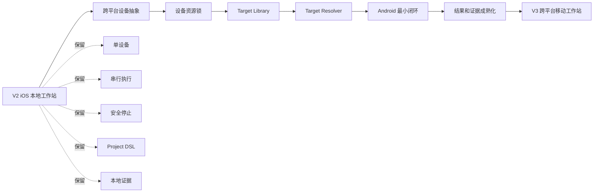
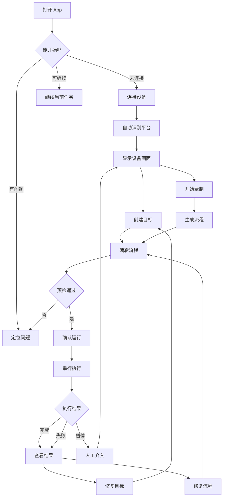
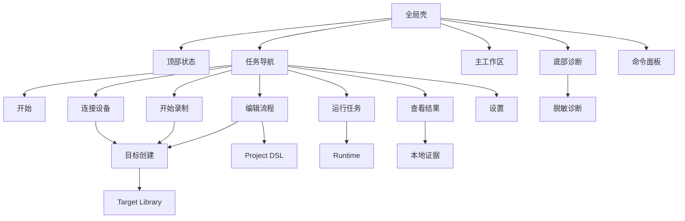
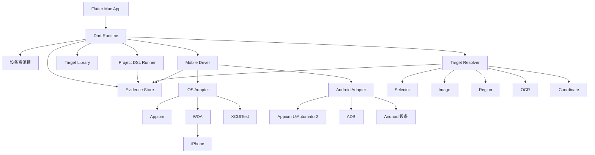
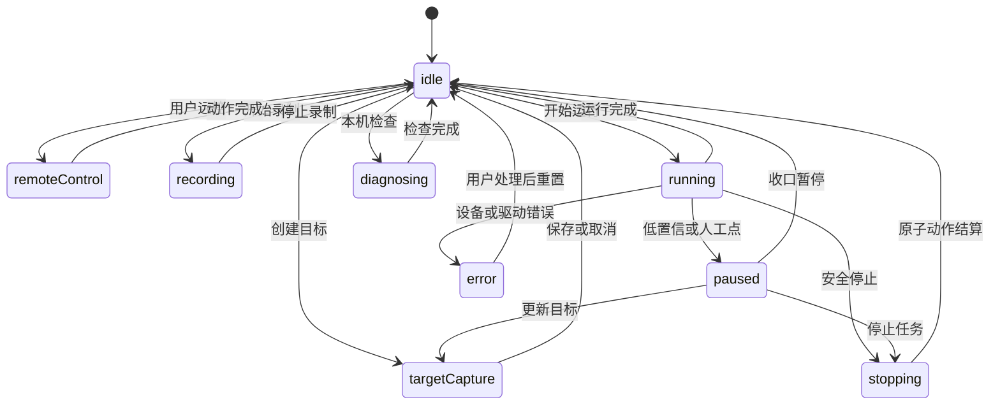
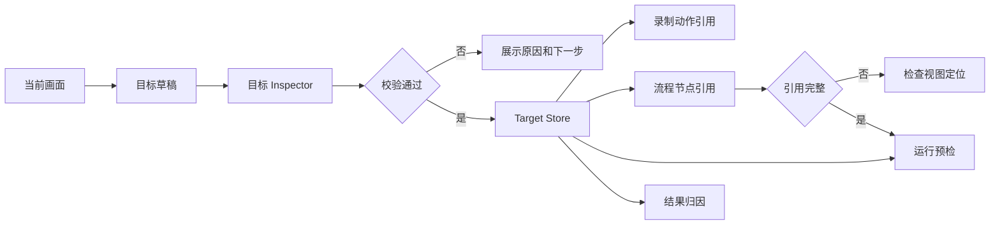
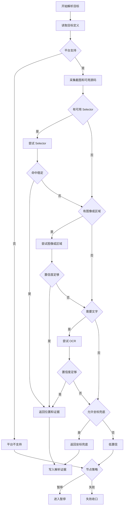
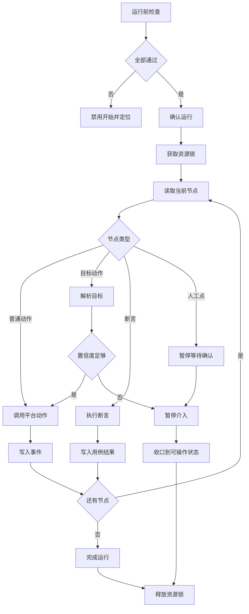
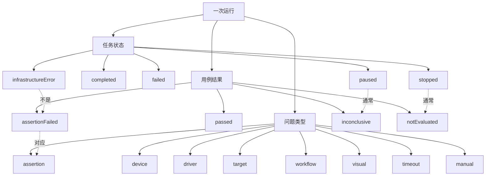
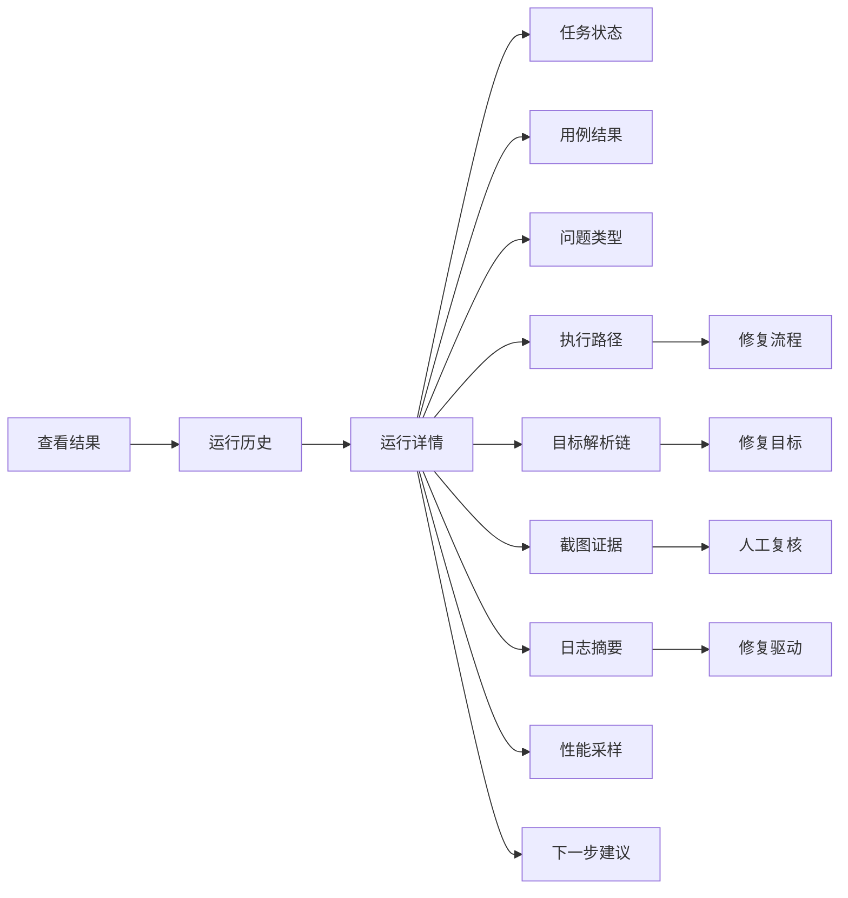

# V3.0 Flowcharts Specialized

本文件是 V3.0 流程图专项产物。它不是提示词，而是可直接渲染的 Mermaid 图表真源。

设计约束：

- 单人、单设备、本地 Mac 桌面工作站。
- 支持 iOS 或 Android 当前设备，但同一时刻只有一台当前设备。
- Target Library 不升为 L1，作为连接设备、录制和编辑流程的共享能力。
- 低置信不盲点，默认暂停或失败收口。
- 任务状态、用例结果和问题类型分离。

## 1. V2 To V3 Evolution Map

## 2. Product Total Flow

## 3. Task-Based Information Architecture

## 4. Cross-Platform Runtime Architecture

## 5. Device Resource Lock State Machine

## 6. Target Library Data Flow

## 7. Target Resolver Decision Flow

## 8. Workflow Execution Flow

## 9. Run Status, Test Result And Issue Category

## 10. Monitor Evidence Reading Flow

