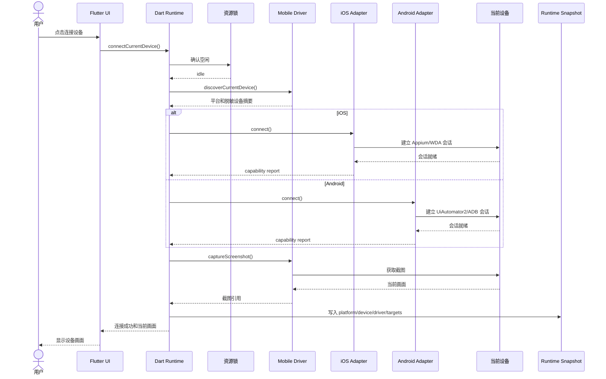
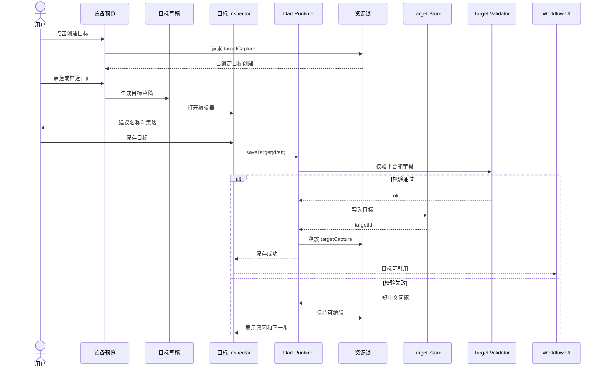
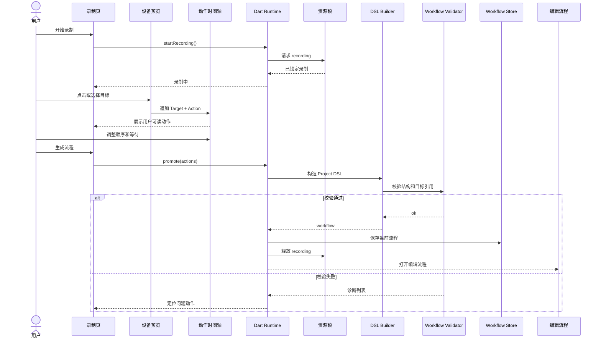
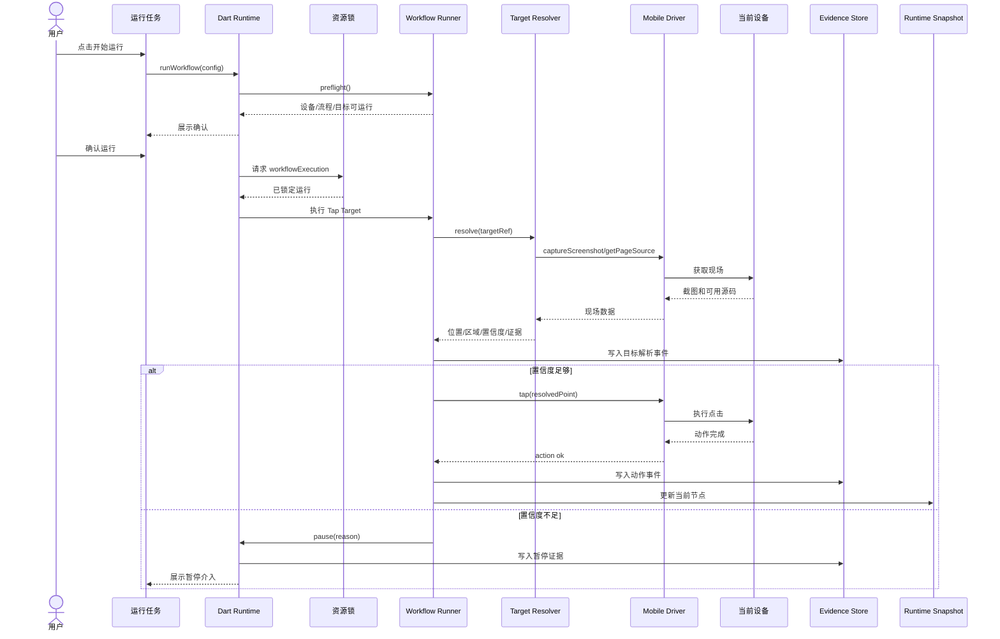
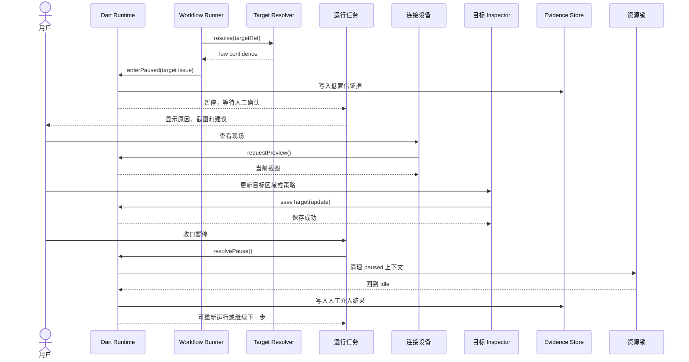
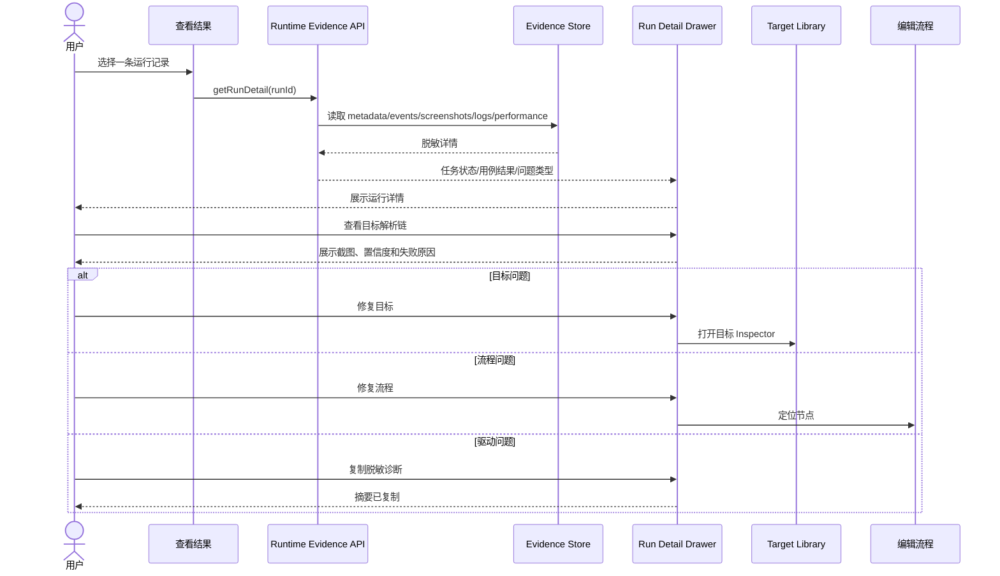
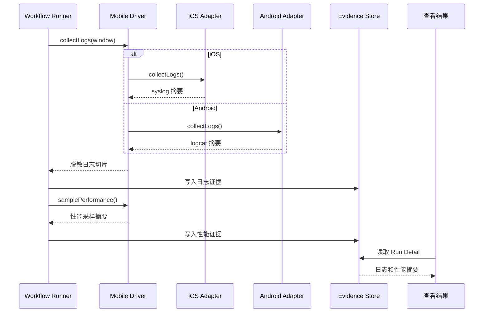

# V3.0 Sequence Diagrams Specialized

本文件是 V3.0 时序图专项产物。它不是提示词，而是可直接渲染的 Mermaid 时序图真源。

共同约束：

- UI 不直接调用 iOS / Android adapter。
- Runtime 拥有资源锁、状态机、Workflow、Target 和 Evidence。
- Target Resolver 只返回解析结果和证据，不直接点击。
- 低置信不盲点，默认进入暂停或失败收口。
- 复制和展示内容必须脱敏。

## 1. Connect Current iOS Or Android Device

## 2. Create Target From Device Preview

## 3. Record Flow And Promote To Workflow

## 4. Execute Tap Target Node

## 5. Low Confidence Pause And Manual Intervention

## 6. Monitor Opens Run Detail

## 7. Collect Logs And Performance During Run

