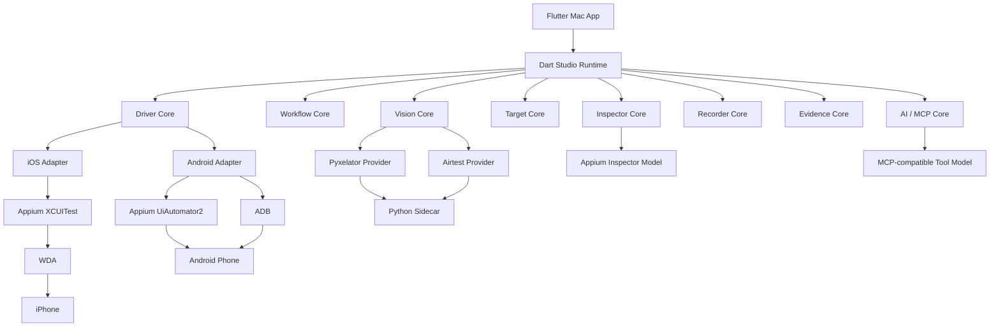

# iOS Assist Studio V4.0 Architecture: Integrated Mobile Workstation

## 0. TL;DR

- V4.0 架构目标是把成熟开源项目吸纳为能力层，而不是把四套运行时拼在一起。
- Flutter Mac App 继续是唯一产品入口。
- Dart Runtime 继续是主编排层。
- Appium 是 iOS / Android 的主驱动协议。
- Python Sidecar 是 Airtest / Pyxelator 等视觉能力的正式组成部分，但不是主执行引擎。
- Node 不再进入主链路；appium-mcp 的价值通过协议和工具模型移植吸收。
- Android 在 4.0 首版必须完成真机冒烟闭环。

## 1. Target Architecture



## 2. Layer Responsibilities

| 层 | 责任 | 不能做什么 |
|---|---|---|
| Flutter Mac App | 中文 UI、工作区、导航、抽屉、画布、控制台 | 直接调用设备、直接写底层驱动 |
| Dart Runtime | 状态机、资源锁、workflow 执行、证据、平台适配调度 | 绕过 Project DSL、绕过资源锁 |
| Driver Core | iOS / Android 统一设备能力接口 | 暴露平台私有细节给页面 |
| Inspector Core | 截图、Source、元素树、命令和属性模型 | 复制 Appium Inspector Electron UI |
| Target Core | 目标定义、目标引用、目标校验 | 把目标写死为某个平台字段 |
| Vision Core | 目标解析、置信度、视觉证据 | 直接点击设备 |
| Recorder Core | 捕获动作、绑定证据、生成 workflow | 录制时直接执行自动化流程 |
| Evidence Core | 本地历史、截图、日志、报告和保留策略 | 上传云端、长期保存隐私画面 |
| AI / MCP Core | 生成建议、工具协议、失败解释 | 越权执行、恢复 Node 中间层 |

## 3. Runtime Contracts

### 3.1 MobileDeviceDriver

平台中立接口方向：

- discoverCurrentDevice
- connect
- disconnect
- heartbeat
- captureScreenshot
- getPageSource
- tap
- swipe
- inputText
- launchApp
- stopApp
- pressHome
- collectLogs
- releaseActions

所有方法必须返回结构化结果，不能把底层异常原样抛给 UI。

### 3.2 Platform Adapter

iOS Adapter：

- Appium XCUITest session。
- WDA screenshot。
- WDA page source。
- W3C pointer actions。
- iOS 系统限制诊断。

Android Adapter：

- Appium UiAutomator2 session。
- ADB device discovery。
- ADB screenshot / logcat / dumpsys。
- W3C actions 或 ADB input 兜底。
- Android 授权、调试模式和连接诊断。

### 3.3 Capability Report

每个平台 adapter 必须提供能力报告：

- screenshot
- tap
- swipe
- input
- pageSource
- selectorTarget
- imageTarget
- ocrTarget
- appLifecycle
- logs
- performance
- remotePreview

用途：

- Device 就绪检查。
- Execute 运行前检查。
- Workflow validator 平台诊断。
- Target Library 可用性提示。

### 3.4 TargetResolver

TargetResolver 不执行动作，只解析目标。

输入：

- 当前截图。
- 目标定义。
- 平台能力。
- 置信度阈值。
- 上下文。

输出：

- matched / notMatched / lowConfidence / unsupported / infrastructureError。
- 坐标或区域。
- 置信度。
- 证据引用。
- 用户可理解原因。

### 3.5 VisionProvider

VisionProvider 是 Vision Core 的可插拔后端。

首批 provider：

- CoordinateProvider：纯坐标。
- SelectorProvider：元素树和 locator。
- PyxelatorProvider：轻量模板匹配。
- AirtestProvider：图像识别和断言辅助。

规则：

- Provider 不持有设备动作能力。
- Provider 不保存完整设备标识。
- Provider 输出必须经过 Runtime 统一证据写入。

### 3.6 AiToolAdapter

AI / MCP Core 只暴露受控工具。

允许工具方向：

- readCurrentScreenSummary
- proposeWorkflowDraft
- explainRunFailure
- suggestTarget
- suggestLocator
- suggestTemplateFix

禁止工具方向：

- 直接点击。
- 直接启动运行。
- 直接绕过确认修改 workflow。
- 直接读取未脱敏设备标识。
- 默认上传截图。

## 4. Open Source Capability Mapping

| 来源项目 | 吸纳到哪一层 | 方式 |
|---|---|---|
| Airtest | Vision Core、Recorder Core、Evidence Core | Python 依赖、Sidecar、报告模型参考 |
| Pyxelator | Vision Core、TargetResolver | Python 依赖优先，必要时复制小模块 |
| Appium Inspector | Inspector Core、Driver Core | 协议和体验移植，不嵌 Electron |
| appium-mcp | AI / MCP Core | MCP 工具模型移植，不引入 Node 服务 |

## 5. Node Exit Boundary

V4.0 明确不恢复 Node 中间层。

禁止：

- Flutter App 调用 Node API。
- Dart Runtime 调用 Node Runner。
- Node 作为 MCP 常驻服务进入主链路。
- Node 承担 workflow 执行。
- Node 承担设备连接、视觉定位或报告生成。

允许：

- Legacy Node 作为历史参考短期留存。
- 迁移完成后删除 Legacy Node。
- 通过文档记录已迁移能力。

删除前置条件：

- Dart Runtime 覆盖旧连接和运行价值。
- Workflow DSL 覆盖旧 sequence 价值。
- Flutter Mac App 覆盖旧 Web 看板价值。
- 旧 CLI 不再承担唯一可用能力。

## 6. Python And Go Boundary

Python 是 V4.0 正式组成部分，用于 Airtest、Pyxelator、CV/OCR 和视觉 sidecar。

Python Sidecar 规则：

- 可选安装。
- 能力探测。
- 失败不阻断坐标和 Appium 基础流程。
- 不保存敏感输入。
- 不直接控制设备。
- 与 Runtime 通过受控本地协议通信。

Go 可以作为未来本机守护、driver broker 或高性能 sidecar 候选，但不是 4.0 首版必须项。若未来引入 Go 基座，必须另开 ADR，并说明为什么 Dart Runtime + Python Sidecar 不足。

## 7. Data Ownership

Project Workspace 统一管理：

- workflow
- target library
- template images
- run history
- screenshots
- reports
- settings
- third party notices

Project DSL 仍是 workflow 唯一真源。

Target Library 是目标定义真源。

Evidence Store 是运行证据真源。

Third Party Notices 是复制或 vendored 代码的归属真源。

## 8. Execution Flow

```text
用户点击运行
  -> Execute Preflight
  -> Runtime 获取资源锁
  -> Workflow Validator
  -> Platform Capability Check
  -> 节点串行执行
  -> 如节点引用 target，先 TargetResolver
  -> 可信后由 Driver Core 执行动作
  -> Evidence Core 写入事件和截图
  -> 失败时进入 Catch / Paused / Failed
  -> Run Detail 汇总
```

## 9. Safety Rules

- 当前设备只有一个。
- 设备动作串行。
- 运行中不能编辑 workflow。
- 运行中不能编辑 target。
- 视觉低置信默认暂停。
- AI 只能建议，不能越权执行。
- Python Sidecar 不能直接点击。
- TargetResolver 不能直接点击。
- Driver Adapter 不能绕过 Runtime。
- 复制诊断必须脱敏。

## 10. Verification Strategy

每个核心层都必须可 fake-test：

- Driver Core：fake iOS / fake Android。
- TargetResolver：fixture screenshot。
- VisionProvider：fixture image。
- Workflow Core：无设备执行模型。
- Evidence Core：临时目录。
- Inspector Core：fake page source。
- AI Core：fake tool call。

真实设备验收：

- iOS 真机深验证。
- Android 真机最小冒烟。
- 两个平台都必须产出本地证据。
